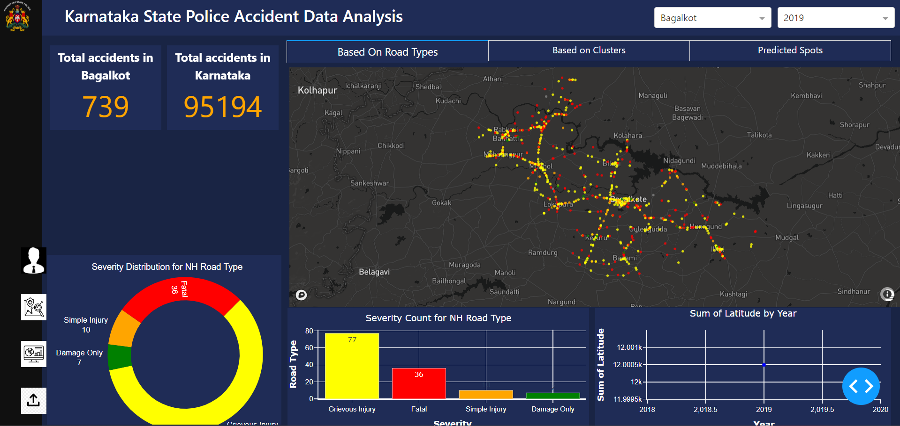
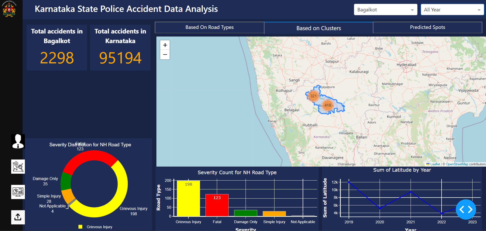
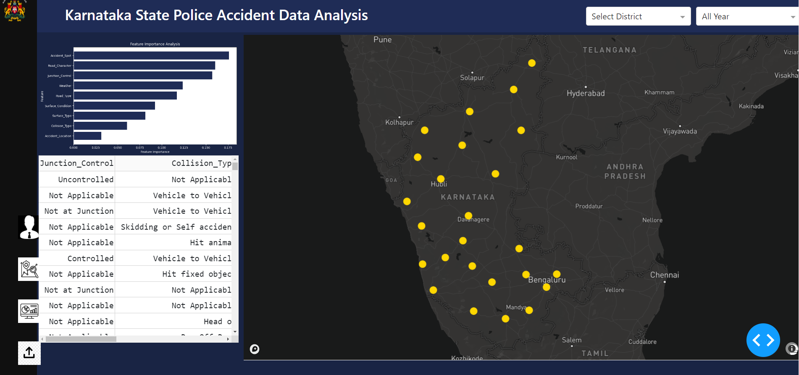
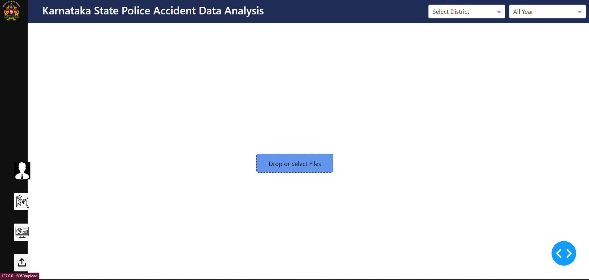

---

# 🚨 Lifeline: Accident Data Analysis for Karnataka State Police Hackathon

**Lifeline** is an advanced data analysis system designed to assist the Karnataka State Police in accident data analysis. By leveraging accident-related data, Lifeline aims to identify patterns, high-risk locations, and contributing factors (such as weather, road conditions, and driver behavior) to enhance road safety and prevent future accidents.

---

## 📜 Problem Statement

Despite collecting large amounts of data related to road accidents, traditional methods of analyzing this information often fail to reveal deeper insights into patterns, root causes, or contributing factors. This results in missed opportunities for effective preventive measures. The **Lifeline** project seeks to tackle this issue by providing advanced analytical capabilities to better understand the dynamics of road accidents and inform targeted interventions for reducing both accident frequency and severity.

---

## 🎯 Key Objectives

- **Comprehensive Data Analysis**: To identify the key causes and contributing factors behind road accidents, from weather conditions and road infrastructure to driver behavior.
- **Spatial and Temporal Distribution**: To recognize patterns in accident occurrences based on location and time, enabling better planning of safety interventions.
- **Severity Classification**: To classify accidents into categories (fatal, serious injury, light injury), allowing for more targeted policy decisions and improved emergency responses.
- **Prediction Model**: To utilize a hybrid machine learning model (K-Means clustering + Random Forest classification) for predicting accident severity with improved accuracy.

---

## 🛠 Approach

Our approach is centered around a multi-variable analysis of accident data, encompassing factors such as:

- Time of the accident
- Driver demographics (age, experience)
- Vehicle characteristics (type, model, condition)
- Location and road conditions
- Weather patterns

By identifying patterns, correlations, and trends in these variables, **Lifeline** provides insights into the root causes of accidents and makes it easier to predict potential future accidents.

### Prediction Model
We implemented a hybrid model combining **K-Means clustering** for grouping similar accident scenarios and **Random Forest classification** to predict the severity of an accident. This combination increases accuracy over traditional methods by capturing both structured patterns (from K-Means) and random variations (handled by Random Forest).

---

## 🌍 Impact

The **Lifeline** project is designed to have a profound impact on road safety within Karnataka. By offering the police actionable insights into accident trends and high-risk areas, **Lifeline** empowers them to implement:

- **Targeted interventions**: Traffic safety measures in areas most prone to accidents.
- **Infrastructure improvements**: Road condition improvements in accident-prone zones.
- **Enhanced emergency response**: By knowing where and when accidents are most likely to occur, response times can be improved.

---

## 💻 Technologies Used

- **Python Libraries**: Dash, Flask, Folium, Plotly, Sklearn, Keplergl
- **Data Visualization**: Interactive maps and charts for easy interpretation of accident data
- **Cloud-Based Deployment**: The system can be deployed on the cloud for easy accessibility

---

## ⚙️ Installation Guide

To set up and run the Lifeline project locally, follow these steps:

### 1. Clone the Repository
First, clone the project repository:
```bash
cd Traffic_accident_data_analysis
```

### 2. Set up a Virtual Environment (Optional but Recommended)
It's good practice to use a virtual environment for dependency management:

- **Windows:**
    ```bash
    python -m venv .venv
    .\venv\Scripts\activate
    ```

- **macOS/Linux:**
    ```bash
    python3 -m venv .venv
    source .venv/bin/activate
    ```

### 3. Install Dependencies
Install all the required Python packages:
```bash
pip install -r requirements.txt
```

### 4. Run the Application
After successful installation, run the application locally:
```bash
python app.py
```

The app should now be accessible at `http://127.0.0.1:8050` in your browser.

---

## 🌟 Key Features

- **Comprehensive Accident Analysis**: Analyzes accident data to identify causes and contributing factors, helping authorities make informed decisions.
- **Cluster-Based Mapping**: Interactive maps displaying accident hotspots and high-risk areas using clustering techniques.
- **Prediction Model**: Hybrid machine learning model to predict accident severity and high-risk areas for preventive measures.
- **User-Friendly Dashboard**: Easy-to-use interface for exploring accident data and generating insights.

---

## 📊 Screenshots

### 1. Main Dashboard (All Districts)


### 2. Dashboard for Ballakot (Year 2019)


### 3. Cluster-Based Accident Map


### 4. Prediction of Accident Areas


### 5. File Upload Page


---

## 🛠 Dependencies

The following Python libraries are required to run the project:

- **Dash**: For building web-based interactive dashboards
- **Flask**: For backend web services
- **Folium**: For generating interactive maps
- **Plotly**: For creating advanced charts and graphs
- **Sklearn**: For machine learning models (K-Means, Random Forest)
- **Kepler.gl**: For geospatial analysis

---

## 🚀 Deployment

To deploy this project, you can run the following command:
```bash
python app.py
```

For cloud deployment, use your preferred cloud platform (e.g., AWS, GCP, Heroku) to host the application for wider access.

---

## 🌐 Get Involved

To get involved, feel free to reach out and collaborate with us on this important initiative!


